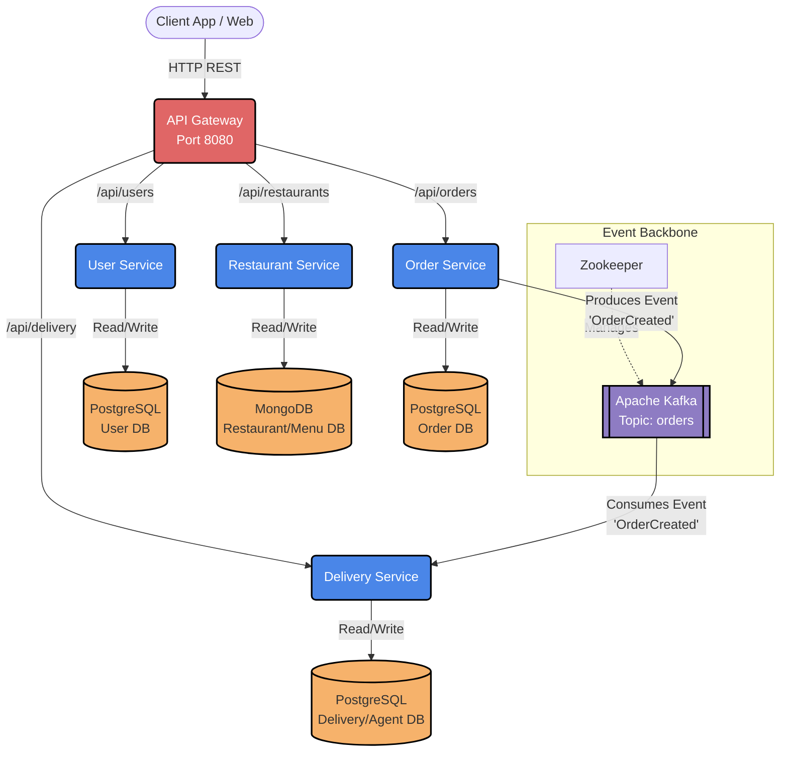
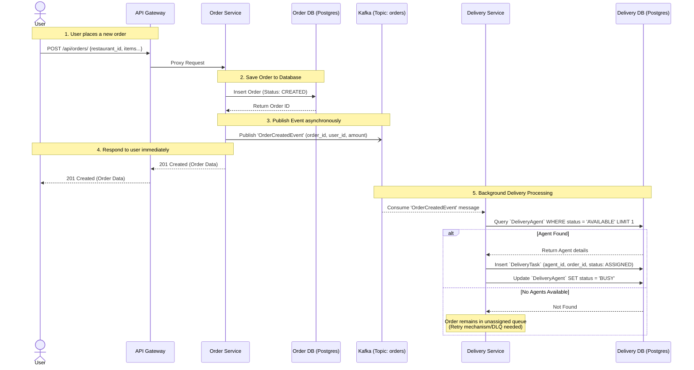

# Go-Food Architecture Design

This document outlines the High-Level Design (HLD) and Low-Level Design (LLD) for the Go-Food backend microservices. These diagrams will help developers understand how communication flows between the different services.

## High-Level Design (HLD)

The HLD provides a bird's-eye view of the entire system architecture, showing all the deployed microservices, their dedicated databases, and the event streaming platform used for asynchronous communication.

> [!NOTE]
> Every microservice manages its own decoupled database to ensure that there are no single points of failure and to allow each service to scale independently based on load.

---

## Low-Level Design (LLD)

The LLD diagrams zoom into specific system flows. The most complex flow in our current architecture is the **Order Placement and Delivery Assignment Flow**.

### Order Placement and Auto-Assignment Sequence

This sequence diagram details the exact synchronous API calls and asynchronous Kafka events that occur when a user successfully checks out an order.

### Component Breakdown

| Microservice | Responsibility | DB | Integration Points |
|--------------|----------------|----|-------------------|
| **API Gateway** | Request routing, Rate limiting (planned), Auth parsing | N/A | Proxies to all internal services |
| **User Service** | Registration, Authentication, Profile Management | Postgres | None (sync response only) |
| **Restaurant** | Restaurant onboarding, Menu item configuration | MongoDB | None (sync response only) |
| **Order Service** | Checkout computations, Order tracking/history | Postgres | **Produces** to Kafka |
| **Delivery** | Delivery agent lifecycle, fleet tracking, geo-location | Postgres | **Consumes** from Kafka |
